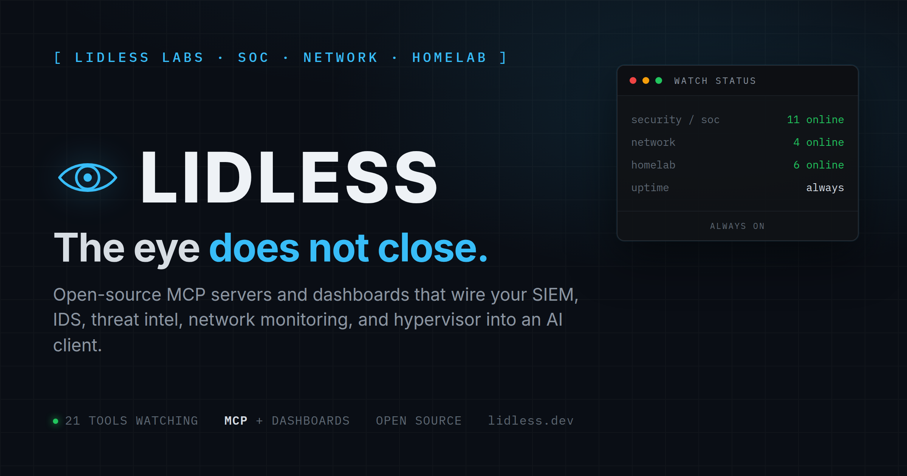

<p align="center">
  
</p>

# Lidless Labs

The eye does not close.

Home of [SOC Stack](https://github.com/lidless-labs/soc-stack): one command stands up a full open-source Security Operations Center on a single Proxmox host. The rest of Lidless Labs is the instrument rack around it: SIEM, IDS, threat intel, network, and homelab tools that a shell, a cron job, or an AI client can query under pressure. Local-first, open source, no telemetry.

## Flagship

- [SOC Stack](https://github.com/lidless-labs/soc-stack) - Wazuh, TheHive, Cortex, MISP, Zeek, and Suricata, plus dashboards and their MCP servers, wired together on one Proxmox host in a single non-interactive run.

## Security / SOC

Detection, triage, and case work, plus the MCP servers that back a live SOC.

- [wazuh-mcp](https://github.com/lidless-labs/wazuh-mcp) - Wazuh SIEM/XDR: alerts, agents, vulnerabilities, and rules.
- [misp-mcp](https://github.com/lidless-labs/misp-mcp) - MISP threat intelligence: IOC lookups, correlation, and exports.
- [suricata-mcp](https://github.com/lidless-labs/suricata-mcp) - Suricata IDS/IPS EVE JSON alert analysis and rule workflows.
- [thehive-mcp](https://github.com/lidless-labs/thehive-mcp) - TheHive incident response: cases, alerts, tasks, and observables.
- [cortex-mcp](https://github.com/lidless-labs/cortex-mcp) - Cortex analyzers and responders for observable analysis.
- [mitre-mcp](https://github.com/lidless-labs/mitre-mcp) - MITRE ATT&CK mapping, group profiling, and detection-gap analysis.
- [zeek-mcp](https://github.com/lidless-labs/zeek-mcp) - Zeek + Suricata NSM log querying and correlation.
- [hotwash](https://github.com/lidless-labs/hotwash) - SOC playbook parser with mermaid diagrams and Wazuh alert ingestion.

## Threat Intelligence & OSINT

Turn indicators, feeds, and graphs into answers instead of open tabs.

- [cyberbrief](https://github.com/lidless-labs/cyberbrief) - AI threat-intel briefings with BLUF reports and ATT&CK mapping.
- [intel-workbench](https://github.com/lidless-labs/intel-workbench) - Structured analytic techniques: ACH matrices and STIX export.
- [maltego-mcp](https://github.com/lidless-labs/maltego-mcp) - Maltego graph authoring and OSINT lookups for whois, DNS, and ASN.
- [vervet](https://github.com/lidless-labs/vervet) - Threat hunting for Zeek and Suricata logs with per-host risk scoring.

## Network

Watch what changed on the wire: configs, ports, topology, and alerts.

- [librenmsctrl](https://github.com/lidless-labs/librenmsctrl) - LibreNMS devices, ports, alerts, acknowledgements, and maintenance windows.
- [n8nctrl](https://github.com/lidless-labs/n8nctrl) - n8n workflow inspection, validation, execution, and ops automation.
- [watchtower](https://github.com/lidless-labs/watchtower) - NOC dashboard with interactive topology and LibreNMS/Proxmox integration.
- [portgrid](https://github.com/lidless-labs/portgrid) - Switch-port visualization for LibreNMS with color-coded views and search.
- [cutsheet](https://github.com/lidless-labs/cutsheet) - Network change intelligence: watches device configs and tells you what changed.
- [eero-cli](https://github.com/lidless-labs/eero-cli) - CLI for the eero mesh API with non-interactive auth and device filtering.

## Homelab

Operate the boxes you already run without handing an agent the keys.

- [proxmox-mcp](https://github.com/lidless-labs/proxmox-mcp) - Proxmox VE inventory and safe-write VM, container, and node operations.
- [adguardctrl](https://github.com/lidless-labs/adguardctrl) - AdGuard Home DNS filtering across read, safe-write, and destructive tiers.
- [immichctrl](https://github.com/lidless-labs/immichctrl) - Immich photo library search, albums, people, and duplicate workflows.
- [jellyctrl](https://github.com/lidless-labs/jellyctrl) - Jellyfin playback sessions, library scans, and user admin.
- [proxguard](https://github.com/lidless-labs/proxguard) - Proxmox security auditor with CIS benchmarks and remediation scripts.
- [samba-ad-migration](https://github.com/lidless-labs/samba-ad-migration) - Windows AD to Samba file-share migration scripts for Proxmox.

## Start here

Stand up the whole lab on a Proxmox host:

```bash
curl -sSL https://raw.githubusercontent.com/lidless-labs/soc-stack/main/install.sh | sudo bash
```

Or browse the [watch floor at lidless.dev](https://lidless.dev) and start with the tool that matches the system you already run.
